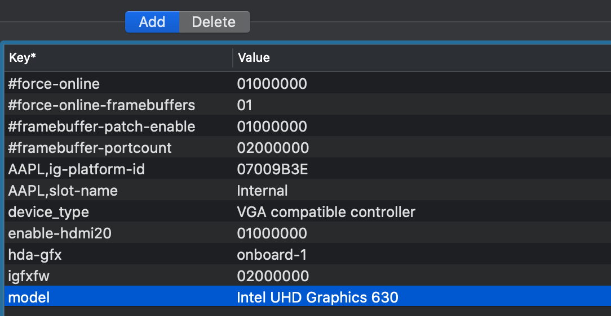

# HP Z2 Mini G4

## Quick start

1. Generate missing part in platform info
2. For IGPU only users, uncomment the top 4 properties in IGPU (remove hashtag), force-online fixes some black screen after waking problem

3. For users that are using other Wi-Fi card, choose to enable AirportBrcmFixup/IntelBluetoothInjector in Kernel section
4. For all users, disable all HP sure start related options in BIOS and secure boot
5. For thunderbolt users, change thunderbolt security to No Security (need to disable the password requirement option before thunderbolt security option first, and reboot to reveal the no security option). Disableing Native hot plug seems no difference, leave it whatever you want.
6. Voila!

## Hardware

This configuration is made for HP Z2 Mini G4 Performance Kit and should be compatible to all HP Z2 Mini G4:

| Hardware        | Configuration                                                |
| --------------- | ------------------------------------------------------------ |
| Power           | 230W                                                         |
| CPU             | i7-8700                                                      |
| GPU\*           | AMD Radeon Pro WX 4150 (or UHD 630)                          |
| Memory          | 64G KHX2666C16S4/32G                                         |
| SSD             | SN 730                                                       |
| Thunderbolt\*\* | HP Flex-IO Thunderbolt 3TQ25AA (JHL 6340 Alpine Ridge)       |
| Audio           | Conexant CX20632                                             |
| Ethernet        | Intel I219-LM                                                |
| Wi-Fi\*\*\*     | BCM 94360NG (reassembled MacBook Air BCM94360 by FENVI, has apple bluetooth issues under windows, such as combo headset's mic not working, but everything works out of the box under macOS, including Handoff/Continuity/Unlock with Apple Watch/Instant Hotspot) |

\* MXM GPU must be present in order to use top 2 DP ports for performance kit.

\*\* Thunderbolt supports hot plug/hot swap, working after sleep/wake. But due to firmware limitation, XHC controller may not work properly. If Thunderbolt is plugged in before boot, XHC controller may be power gated and not useable, causing problem while booting, and vice versa. There is a SSDT with no XHC support (since this model already has 2 Type-C ports). See more results in Thunderbolt section.

\*\*\* This model has enough space to use m2 to apple converter to install native MacBook WiFi adapters, but you could also try BCM94360NG for sake of simplicity (with a little costly price).

## Reference USB customization

| Position  | HS Port | SS Port |
| ---- | ---- | ---- |
| Left top | HS06     | SS07 |
| Left bottom | HS09 | SS08 |
| Left Type-C | HS04 | SS06 |
| Back top | HS08 | SS04 |
| Back bottom | HS12 | SS05 |
| Back Type-C | HS01 | SS02 |
| Bluetooth | HS14 |      |
| Thunderbolt\* | HS10 |      |

\* XHC functionality of Thunderbolt port is powered by Thunderbolt controller, in device XHC2, not XHC, thus needs no customization. But HS Port is routed to motherboard's companion port, which is listed in customization.

## Thunderbolt discoveries

1. The current situation of this thunderbolt supports native hotplug/hotswap/sleep, and it still works properly after wake.
2. Thunderbolt switch (for ethernet) can be enabled but not the at same time with PCI. By using the modified ThunderboltReset.kext and `SSDT-TbtOnPCHE0C-drom.aml`, Thunderbolt switch works properly and also supports hot plug. PCI functionality is completely not working.
3.  The above is achieved on a non-patched JHL6340 thunderbolt controller.

### Thunderbolt SSDTs

1. `SSDT-TbtOnPCHE0C.aml`: This is the SSDT with XHC2 and PCI hotplug enabled
2. `SSDT-TbtOnPCHE0C-noxhc2.aml` : This  is the SSDT with PCI hotplug enabled, removed XHC2 for stability
3. `SSDT-TbtOnPCHE0C-drom.aml`: This is the SSDT with Thunderbolt switch hotplug enabled, should work with ThunderboltReset.kext in this repo. What it did is injecting DROM, everything else is the same as first one. ThunderboltReset did some unexplained change to the Ridge and enabled the switch.

### Note

1. This thunderbolt SSDT (and the modified kext) is based on [ThunderboltReset](https://github.com/osy86/ThunderboltReset). Credit osy86
2. Thunderbolt controller is RP05.
3. Thunderbolt hotplug GPE is `_E0C`
4. Thunderbolt DROM is extracted under linux (inspired by [this](https://www.kernel.org/doc/html/v4.13/admin-guide/thunderbolt.html), dump the ROM and use [this](https://www.tonymacx86.com/threads/success-gigabyte-designare-z390-thunderbolt-3-i7-9700k-amd-rx-580.267551/page-2343#post-2148640) to extract DROM)

## Miscellaneous

1. For performance kit, if you have MXM GPU installed, the IGPU is by default disabled. This causes some HEVC related issue, and it is better to enable IGPU by doing the following: If you don't need 3 DP ports, set enable Intel HD Graphics on DP1 in BIOS. If you need all DP ports, set enable Intel HD Graphics on Flex IO in BIOS instead. It seems IGPU output is not working properly under macOS if MXM GPU is installed.
2. There is an onboard mic. but it is useless because of the quality. The audio quality is also poor, so get an external speaker is necessary.
3. Apple bluetooth doesn't support combo device under Windows, e.g. AirPods only have stereo available, but hands-off (Mic + earphone) doesn't have any input signal. Getting a USB bluetooth fixes this problem. 

